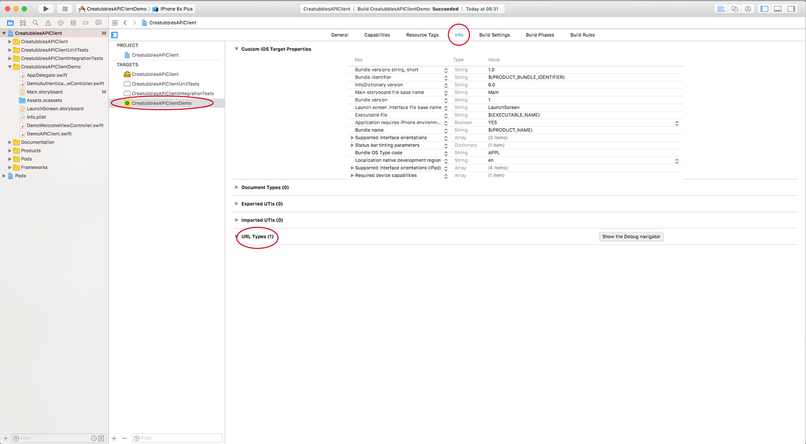
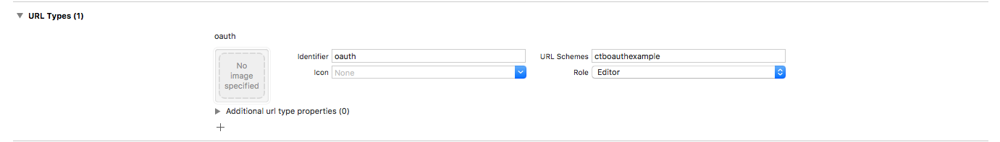
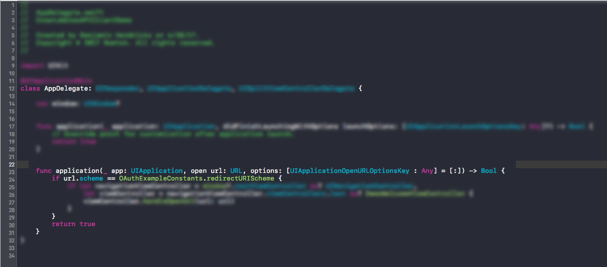
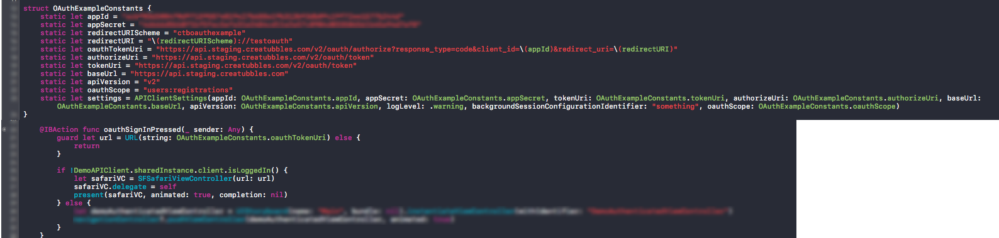

# CreatubblesAPIClient Demo App

## Features Demo'd:
- OAuth Code Flow Authentication
- more coming soon!

### OAuth Code Flow Authentication

##### What is it (from API docs):

***The authorization code flow allows you to get an authenticated user access token without asking the user for their credentials.***
> The general flow is the following:
> 1. redirect the user’s browser to `/v2/oauth/authorize` with **response_type=code**, your **client ID** and a **redirect_uri** as parameters to start authentication flow.
> 2. after the user successfully authorized access for your app, they will be redirected back to your app to given **redirect_uri**, including a code parameter.
> 3. `POST /v2/oauth/token` - with received code to get the access token (see Authorization code: Create Token).

##### Demo App

***Disclaimer:*** The Demo app is meant to provide an example of how to implement the oauth code flow to integrate with Creatubbles. While a couple pieces are fairly set in stone (the iOS SDK standard AppDelegate delegate method, for example), this is not meant as a best-practice, and should be used purely as an example for authentication with a code flow redirect.

##### Background - You'll need:

- The CreatubblesAPIClient client library
- To have asked Creatubbles for an application, so you can receive an application ID and secret (application ID is also referred to as *client ID* in API docs).

##### Setup Steps (3):
##### Step 1 - Setup Callback:
- This should direct the user to the web authentication portal for Creatubbles. Once they have finished authenticating (either successfully or not), through the URI scheme the iOS app will get a callback and be able to act. To set up this scheme, first go to the project settings:

##### Step 2 - Add URL Type: 
- In the `URL Types` area, a new entry is required for the web authentication redirect:

##### Step 3 - Setup AppDelegate:
- In the `AppDelegate` there is an optional delegate method for handling openURL calls to your application, as shown here:

##### User Flow Steps (2):
##### User Flow Step 1 - Safari redirect:
- To begin authorization, redirect mobile user to a Safari session pointed to the `/v2/oauth/authorize` endpoint mentioned in API docs. This can be done with a `SFSafariViewController`, as such:

*Note:* In the image above, notice that the oauthTokenURI is constructed from the base setup in Setup step 2 ("Add URL Type"). 

##### User Flow Step 2 - Done!:
- Once this delegate callback occurs, the `APIClient` will be authenticated (unles authentication failed, in which case you can handle another attempt or whatever should happen next in that situation for your user), and further authenticated-only Creatubbles actions can now be performed by your user.
